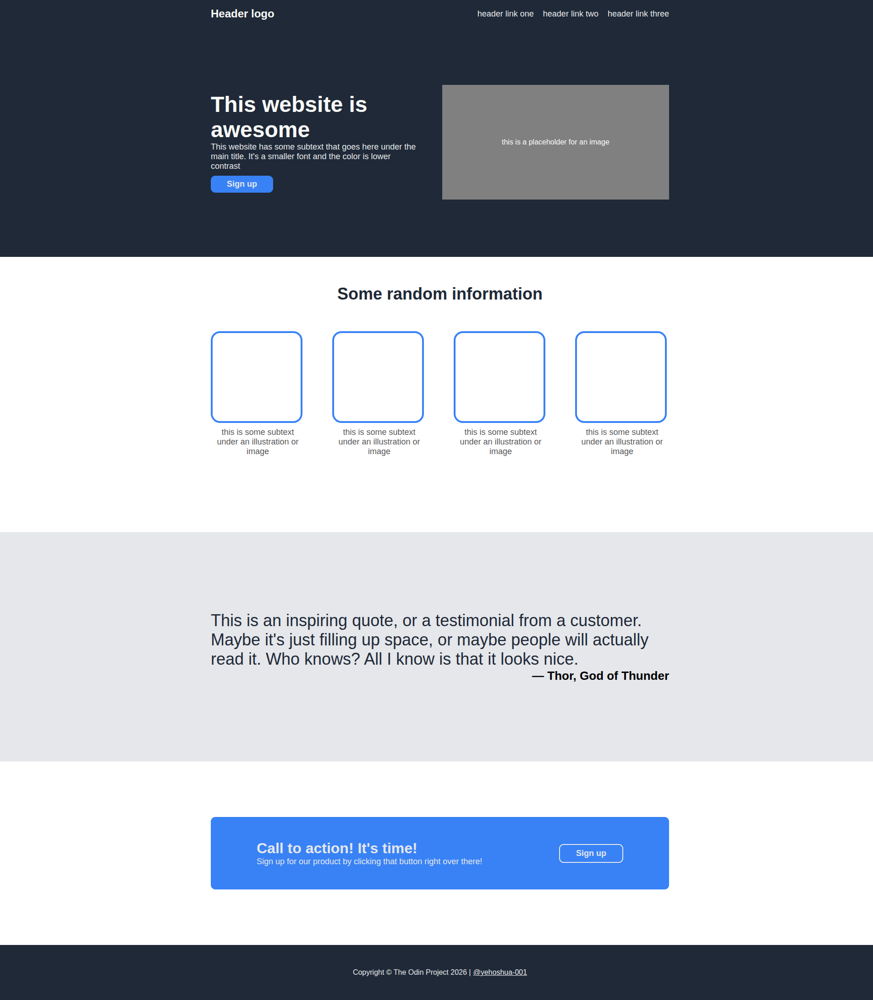
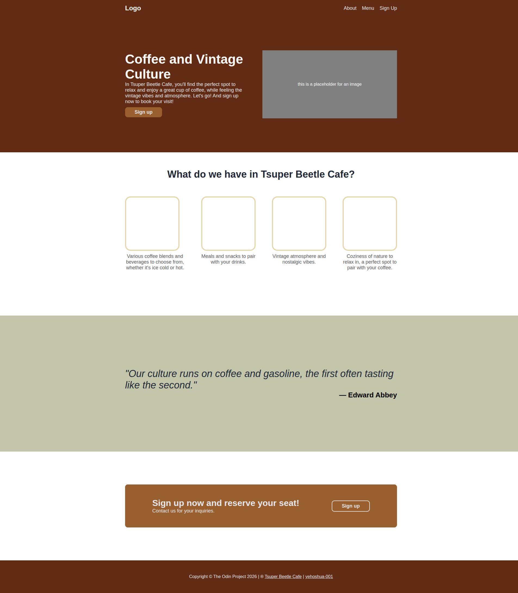
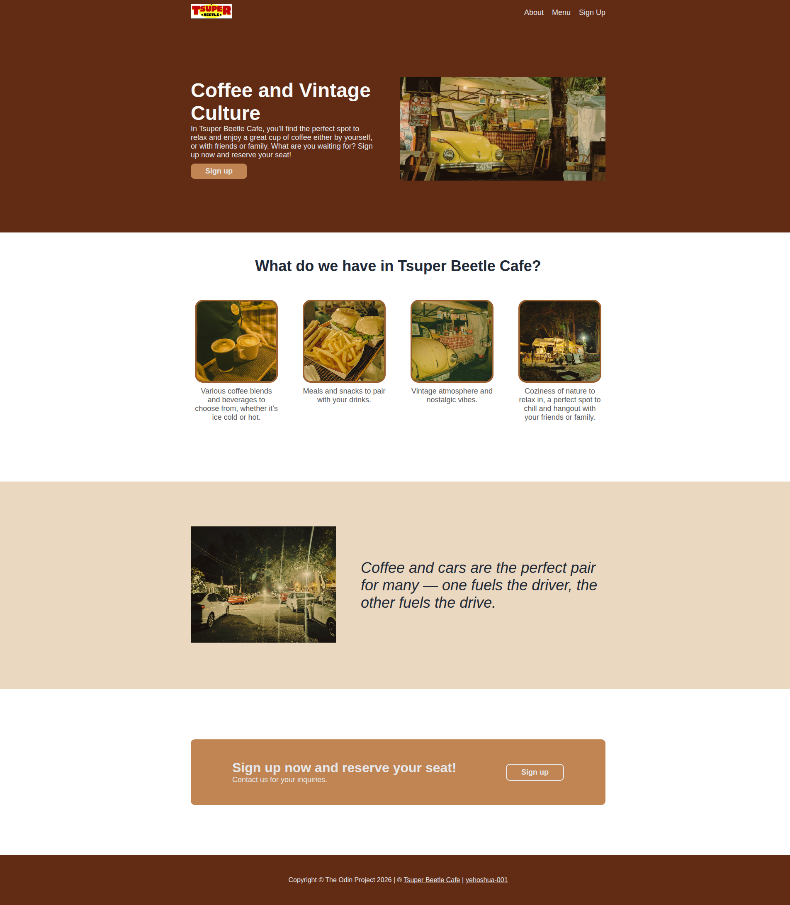

# Project: Landing Page | The Odin Project

## Getting Started
In this project I will make a sample webpage to demonstrate the lessons I learned in CSS particularly the Flexbox layout in [The Odin Project: Foundations Course](https://www.theodinproject.com/paths/foundations/courses/foundations). I will first create the initial design based on the design references, then I will personalize it based on an actual business.

## Progress 
1. Initial design (14/May/2026):  
This is the initial design of the webpage with the default styles and dummy content.  
  
 
 
2. Modified design (15/May/2026):  
Here I changed the content based on an actual business, and the color scheme of the webpage.  
  
 
 
3. Final design (16/May/2026):  
This is the final design of the business landing page.  
  

## Conclusion
I managed to finish all the designs and demonstrated my skills in HTML and CSS using flexbox layout.

## References
<strong>Business:</strong> [Tsuper Beetle Cafe](https://www.facebook.com/profile.php?id=61568507417240)  
The Tsuper Beetle Cafe is owned by my niece and her partner, they gave me their consent to use their business as sample for this project. All the resources such as images and logo is from their business.